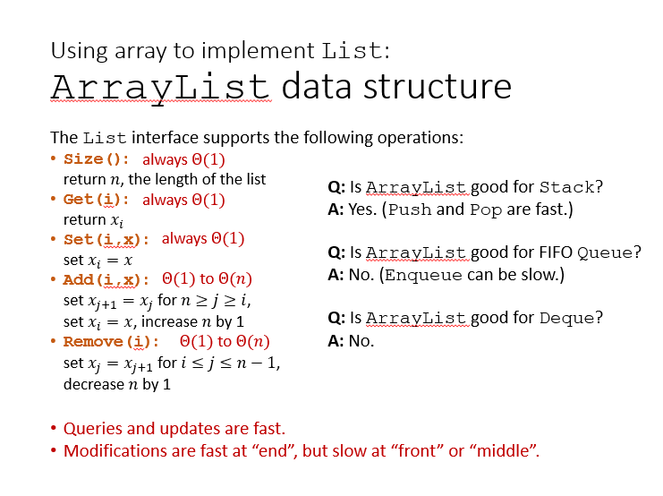
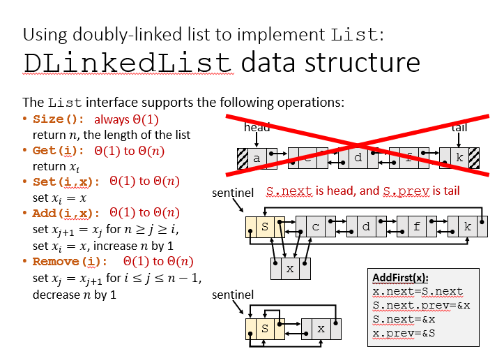

# 渐近记号和严格渐近记号
+ O记号：$\exists c>0,n_0>0, \forall n\geq n_0, f(n)\leq c\cdot g(n)$
+ o记号：$\forall c>0, \exists n_0>0,\forall n \geq n_0, f(n)<c\cdot g(n)$
+ 斯特林公式：$n! = \sqrt{2\pi n}\left(\frac ne\right)^n(1+\Theta(\frac 1n))$

# 抽象数据类型（ADT）
抽象数据类型ADT是一个逻辑概念，而数据结构则是ADT的具体实现

## FIFO Queue
+ Add(x):添加元素x到队尾
+ Remove():删除第一个元素

## LIFO Queue：Stack
+ Add(x)
+ Remove(x)

## Deque
+ AddFirst(x)
+ AddLast(x)
+ RemoveFirst()
+ RemoveLast()

## List
+ Size()
+ Get(i)
+ Set(i, x)
+ Add(i ,x)
+ Remove(i)

---
# Data Structure
下面讨论各种数据类型在实现List时的性能
## Simple ArrayList

+ 适合实现栈，不适合实现队列和Deque

## 使用循环数组实现List
+ 维护一个头指针和尾指针  
  
+ 对于首尾元素的所有操作都很快，但是对于中间元素的操作仍然很慢

## 使用列表实现List

  