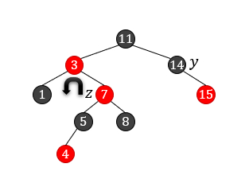
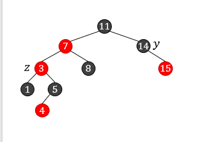

# 红黑树
## 定义
红黑树是一个每个节点都有颜色的BST，并满足以下性质：
+ 每个节点是红或黑的
+ 根节点是黑的
+ 每个叶节点是黑色的
+ 没有两个红色的节点是可以相连的
+ 对于任何一个节点$x$，从他开始走到任意一个叶节点的路径上包含的黑色节点的数目（记为$bh(x)$）是一致的。（黑高度不包含根自己，但包含叶节点）  
**对于红黑树，为了实现上的方便，我们显式地将原本每个叶节点的两个子节点NULL标称为叶节点。也就是说，红黑树中的叶节点实际上是一系列NULL，**

+ 由于黑高度性质，从黑色节点的角度来看红黑树有点像是完美二叉树。从整体角度来看，路径之间的长度差距顶多只会相差红色节点数量这么多，因此相对更加平衡。

## 红黑树的高度
+ **Claim： 在红黑树中，以某个节点x为根的红黑子树至少有$2^{bh(x)}-1$个内节点**  
> proof: induction on height of x  
> Basis: 如果x是叶节点，显然成立  
> Hypothesis: ...对高度为h-1的节点成立  
> Inductive Step: 对于高度为h的节点x，由于他不是叶节点，因此必有两个子节点。所以以x为根的子树节点数$\geq 1+(2^{bh(x.left)}-1)+(2^{bh(x.right)}-1)$  
> 如果节点x和子节点都是黑色的，那么x比子节点的黑高度大1.如果节点x和子结点中有一个是红色的，那么x的黑高度和子节点的黑高度相同。因此归纳易证。  

+ **Claim： 由于无红边性质，$h = height(root)\leq 2*lg(n+1)$**
  + 设n是红黑树的**内节点**，由于根的黑高度至少为h(x)/2，因此$n\geq 2^{h/2}-1$, 得到$h\leq 2\lg(n+1)$.
+ **Theorem**: 红黑树的高度h满足$h=O(\log n)$. 因此，查找、找极值等不改变树的结构的操作都可在$O(\log n)$时间内完成

## 红黑树的插入
得到一个待插入的值z后
+ 将z变为红色，然后按照BST方法进行插入
+ 修复被违反的红黑树性质
  + 可能违反的性质有：根节点是黑色、无红边性质和黑高度性质
  + case 0:z成为根节点
    + fix：将z重新染为黑色即可
  + case 1：z的父节点是红色（这样的话z有黑色的祖父节点），并且z有一个红色叔叔节点。
    + fix：将父亲节点和叔叔节点染成黑色，把祖父节点染成红色。显然这样做后不会影响原树任何节点的黑高度性质。如果祖父节点染红后又违反了RBT性质，不断如此向根节点方向递推即可。
    + 
  + case 2: z的父节点是红色，并且有黑色叔叔节点。z是其父节点的右子节点
    + fix：在z的父结点处左旋。这样就划归为case3
    + 
    + 
  + case 3：z的父节点是红色，有黑色叔叔节点。z是父节点的左孩子
    + fix：在z的祖父节点处右旋，重新将z的父节点和祖父节点染色（换色）。
    + 
    + 

分析可知，插入操作的时间复杂度为$O(\log n)$

## 红黑树的删除
+ 如果z的右子节点是外点，那么z是要被结构化删除的节点：将z的左子树提升上来替代z
+ 如果z的右子节点是内点，设y是z的右子树中值最小的内节点（显然y的左子节点是外点），然后将z的值换成y的值，并把y节点结构化删除：y的右子树将会提升上来替代y
+ 上述操作不改变BST性质。下面我们修复RBT性质。
  + case 1：如果删除的节点k是红色节点，那么RBT性质本身就没有被破坏。因为1.k一定不是根节点 2.不会出现红边 3.红节点的删除不影响黑高度
  + case 2：如果删除的节点p是黑色节点，且被提升节点q是红色节点，那么将提升后的q染成黑色即可。因为黑高度一减一加，所以黑高度也不会变化。
  + case 3：如果删除的节点p是黑色节点，且被提升的点q是黑色节点，那么此时黑高度可能会出问题，进一步讨论
    + case 3.1：q有一个红色的兄弟节点，则旋转并重新上色  
  
    + case 3.2：q有一个黑色兄弟节点
      + case 3.2.1：**TODO...**