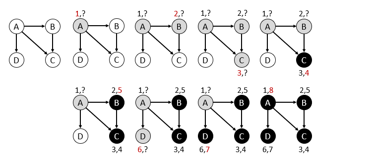
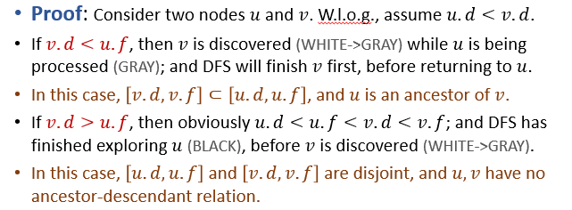
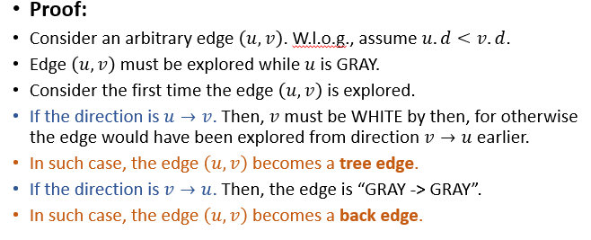

# 图和图搜索

### 邻接矩阵：Adjacency Matrix
+ 考虑图G=(V, E), 其中|V| = n, |E| = m
+ 邻接矩阵是n*n矩阵A = ($a_{ij}$) where a_ij = 1 <=>(i, j) in E
+ 空间开销为$O(mn)$

### 邻接列表：Adjacency List
+ 为每个元素建一个链表，将与这个元素相邻的元素全部加入到链表中。
+ 空间开销为$O(n+m)$

### 邻接矩阵和邻接表的对比
+ 邻接矩阵
  + Fast Query：判断u和v是否相邻/查询一条边是否存在
  + Slow Query：列举u的邻居
+ 邻接表
  + Fast Query：列举u的邻居
  + Slow Query：判断u和v是否相邻/查询一条边是否存在
---
## 图搜索
+ BFS
+ DFS

## DFS
```python
DFSALL(G):
for each node u
    u.color = WHITE
    u.parent = NIL
for each node u
    if u.color == WHITE
        DFS(G, u)
```
```python
DFS(G, s):
s.color = GRAY
for each edge (s, v) in E
    if v.color == WHITE
        v.parent = s
        DFS(G, v)
s.color = BLACK
```
+ 算法过程示例：  
  
+ 时间复杂度
  + 在每个节点上为$O(1)$
  + 在每条边上为$O(1)$
  + 总的运行时间为$O(n+m)$
### DFS应用：计算节点的active intervals
+ discovery time：when the node turn GRAY
+ finish time：when the node turn BLACK
```
DFSALL(G):
PreProcess(G)
for each node u
    u.color = WHITE
    u.parent = NIL
for eanch node u
    if u.color == WHITE
        DFS(G, u)
```
```
DFS(G, s):
PreVisit(s)
s.color = GRAY
for each edge (s, v) in E
    if v.color == WHITE
        v.parent = s
        DFS(G, v)
s.color = BLACK
PostVisit(s)
```
```
PreProcess(G):
time = 0
```
```
PreVisit(s):
time = time+1
s.d = time
```
```
PostVisit(s):
time = time+1
s.f = time
```


### DFS性质
#### 括号定理(Parenthesis Theorem)
+ **[Parenthesis Theorem]: Active intervals of two nodes are either: (a) ectirely disjoint, or (b) one is entirely contained within another.**  
  
  + 当$(v.d, v.f)\subset (u.d, u.f)$时，表明v是u的后代。

#### 白路径定理(White-Path Theorem)
+ [White-Path Theorem]: In the DFS forest, 𝑣 is a descendant of 𝑢 iff when 𝑢 is discovered, there is a path from 𝑢 to 𝑣 containing only WHITE nodes.

### 边的分类
+ **Tree Edge**：Edges in the DFS forest.
+ **Back Edges**: Edges (𝑢,𝑣) connecting 𝑢 to an ancestor 𝑣 in a DFS tree.
+ **Forward Edge**：Non-tree edges (𝑢,𝑣) connecting 𝑢 to a descendant 𝑣 in a DFS tree.
+ **Cross Edges**: Other edges. (Connecting nodes in same DFS tree with no ancestor-descendant relation, or connecting nodes in *different* DFS trees.)

#### 在DFS过程中判定边的种类
+ 在对节点u进行展开时
  + 若v为WHITE：(u, v)为Tree Edge
  + 若v为GRAY：(u, v)为Back Edge
  + 若v为BLACK：(u, v)为Forward Edge或Cross Edge


#### 一些性质
+ [Theorem]: 在对无向图G的DFS中，G的每条边都是Tree Edge或Back Edge  
  
+ 