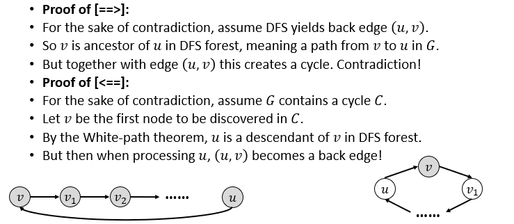

# DAG, Topological Sort and SCC/CC Computing

## Directed Acyclic Graphs(DAG)
+ 有向无环图：适用于解决包含因果关系、等级关系的实际问题
+ **[Lemma1]：有向图G是无环的充要条件为G的DFS中没有back edge**  
  
+ **[Lemma2]：在DAG G中DFS时，对于G中的所有有向边(u, v)，有$u.f>v.f$**
  + 分v是白色节点还是黑色节点证明即可，trivial

### Topological Sort on DAG
+ E(G)实际上定义了V(G)中点的偏序关系，拓扑排序给出的是一个**满足该偏序关系的全序关系。**
+ 由于满足该偏序的全序关系可能不唯一，因此拓扑排序的结果不唯一。
+ 只有DAG才可进行拓扑排序。在下面的算法中，我们不显式地要求G是DAG，而在算法结束时进行检验。
+ DAG的拓扑排序方法:
  + 在G上DFS， 计算沿途所有节点的结束时间
  + 当一个节点结束时，将它插入到一个列表的头部位置。由Lemma2知其正确性。
  + 如果没有发现back edge，则拓扑排序结束并给出了正确的结果。

### source and sink
+ source节点指没有入边的节点。在对DAG的DFS中，拥有最大结束时间的点一定是source节点
+ sink节点指没有出边的节点。在对DAG的DFS中，拥有最小结束时间的点一定是sink节点

### Alt Topological Sort way
+ 找到当前图中的source节点（通过DFS记录结束时间）
+ 从当前图中删除source和牵涉到的边，对剩余图遍历上述过程
---
## CC and SCC
+ **CC**：For an undirected graph 𝐺, a **connected component** is a maximal set 𝐶⊆𝑉(𝐺), such that for any pair of nodes 𝑢 and 𝑣 in 𝐶, there is a path from 𝑢 to 𝑣.
+ **SCC**：For a directed graph 𝐺, a **strongly connected component** is a maximal set 𝐶⊆𝑉(𝐺), such that for any pair of nodes 𝑢 and 𝑣 in 𝐶, there is a directed path from 𝑢 to 𝑣, and vice versa.
### 计算无向图中的连通分量
+ ez，进行一次DFSALL即可
### 计算有向图中的强连通分量
+ 将原图按照各强连通分量收缩为一个点，并把原本的边合并起来，得到的图称为component graph $G^C$
+ **component graph是一个有向无环图(DAG)**，若不然，环中的各连通分量将构成更大的SCC。
+ 如果我们能从component graph当中的sink SCC开始进行遍历，那么遍历过的点都将是sink SCC中的点（根据white path theorem）
+ 为了寻找sink SCC，将G中的所有有向边进行反向，并画出它的component graph $(G^R)^C$，将问题转化为在$(G^R)^C$中寻找source节点
+ **[Lemma3]：for any edge $(u, v)\in E(G^R)$, if $u\in C_i,v\in C_j$, then $\max_{u\in C_i} {u.f}>max_{v\in C_j}{v.f}$**  
  
+ 对$G^R$中的节点进行DFS，得到的结束时间最大的节点一定是$G^R$中的source，也就是$G$中的sink，然后在$G^C$中对该节点进行DFS，得到的为$(G^C)$中的sink SCC
+ 去掉该sink SCC后，继续寻找sink SCC即可。由于之前已经对$G^R$进行过遍历，由引理只需要继续找结束时间最大的节点重复上面一个过程即可。
+ 总的算法过程
  + Compute $G^R$
  + Run DFS on $G^R$ and record finish times $f$
  + Run DFS on $G$ but in DFSALL, process nodes in decreasing order of $f$
  + Each DFS tree is a SCC of $G$
+ 时间复杂度：$O(n+m)
+ 注意点
  + 为什么通过找source的方式寻找sink？因为由结束时间寻找source相较寻找sink更容易