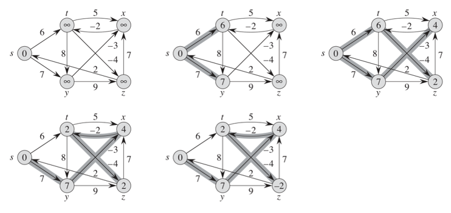

# 单源最短路径问题（SSSP）
+ 任意单位权重图
+ 任意正权重图
+ 任意无负环的有向图
+ 任意有向无环图

## 最短路径问题
+ TODO(补充问题表示)
+ 最短路径？权重最小的路径？
+ 无向图？有向图($w(u, v)\not =w(v, u)$)？
+ $w(u, v)<0$？
  + 如果存在负边，那么负环不能存在。否则不存在最短路径

## 单源最短路径问题
+ **【SSSP Problem】:Given a graph $G=(V, E)$ and a weight function $w$, given a source node $s$, find a shortest path from $s$ to every node $u\in V$**

### SSSP in unit weight graphs
+ $w\equiv 1$
+ 直接使用BFS即可

### SSSP in positive weight graphs
+ 模仿BFS的思路，使用以下算法
+ 为每个节点维护一个变量$T_u$
+ 对于源节点s，$T_s=0$
+ 如果节点u被访问到，那么对于每一条边$(u, v)$，更新$T_v=\min\{T_v, T_u+w(u, v)\}$
+ 每次取出$T_u$最小的节点进行访问，使用最小堆实现即可
+ 遍历结束后，每个节点的$T_u$即为该节点到源节点的最短路径长度

#### Dijkstra's Algorithm
```python
DijlstraSSSP(G, s):
for (each u in V)
    u.dist=INF, u.parent=NIL
s.dist=0
Build priority queue Q based in dist
while (!Q.empty())
    u = Q.ExtractMin()
    for (each edge (u, v) in E)
        if (v.dist > u.dist+w(u, v))
        v.dist = u.dist + w(u, v)
        v.parent = u
        Q.DecreaseKey(u)
```
+ 不难分析，使用小顶堆实现的Dijkstra算法的总的时间复杂度为$O(n+m)\log n$
+ Dijlstra算法也是贪心算法

#### Dijkstra算法的另一种理解
TODO（）

### SSSP in directed graphs with negative weights
+ Dijkstra算法对存在负边的图是不正确的  
  TODO（补充不正确的说明图示）
+ 但是
#### 
+ When processing edge $(u, v)$, execute procedure Update(u, v): v.dist=$\min\{v.dist, u.dist+w(u, v)\}$
+ 这维护了两条重要性质
  + 对于任何一个节点v，v.dist要么是准确的，要么是被过高估计了
  + 如果u是从源节点s到v最短路径上的最后一个节点，那么当我们调用Update(u, v)后，v.dist变为正确的估计
+ 以上两条性质导出，Update(u, v)是正确并且有帮助性的
  + 【safe】：无论Update的操作顺序是怎样的，v.dist要么是被过高估计，要么是正确的
  + 【helpful】：With correct sequence of Update, we get correct v.dist
+ 观察到两点：  
  

#### Bellman-Ford Algorithm
+ Update all edges
+ Repeat above step for n-1 times
```python
BellmanFordSSSP(G, s):
for each u in V
    u.dist = INF, u.parent = NIL
s.dist = 0
repeat n-1 times:
    for each edge (u, v) in E：
        if v.dist>u,dist+w(u, v)
            v.dist = u.dist+w(u, v)
            v.parent = u

for each edge (u, v) in E                     # 判断是否存在负环
    if v.dist > u.dist+w(u, v)
        return "Negative Cycle!"
```

+ 在预知最短路径深度d的情况下，可以只进行d次repeat。
+ **Bellman-Ford还可以判断当前图中是否有负环。**循环进行了n-1次后，如果对于某个节点仍然有v.dist>u.dist+w(u, v)，那么图中一定存在负环。

### SSSP in DAG with negative weights
+ Bellman-Ford算法的核心思想：在每一个包含某条最短路径的边序列上进行Update
+ **【Observation】：在有向无环图中，每一条路径（也就是每一条最短路径），都是拓扑排序的子序列。因此先进行拓扑排序，然后使用拓扑顺序一次更新每个节点即可。**

#### 算法分析
```python
DAGSSSP(G, s):
for each u in V
    u.dist = INF, u.parent = NIL
s.dist = 0
Run DFS to obtain topological order
for each node u in topological order
    for each edge (u, v) in E
        if v.dist > u.dist+w(u, v)
            v.dist = u.dist + w(u, v)
            v.parent = u
```

+ 时间复杂度为$O(n+m)$

#### SSSP in DAG应用：Computing Critical Path
+ 假设需要完成一个包含多个步骤的任务，每一步骤都需要消耗一定时间
+ 对于某些步骤，它们只能在之前的任务都结束后才能开始  

