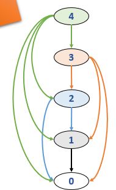
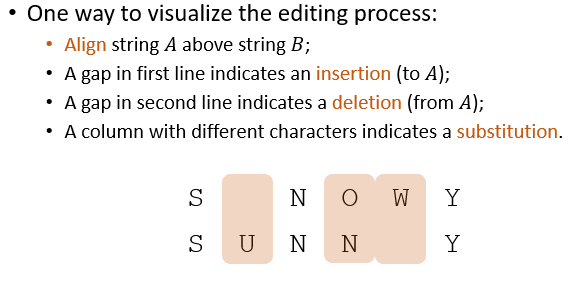
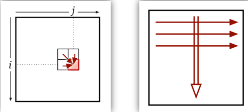
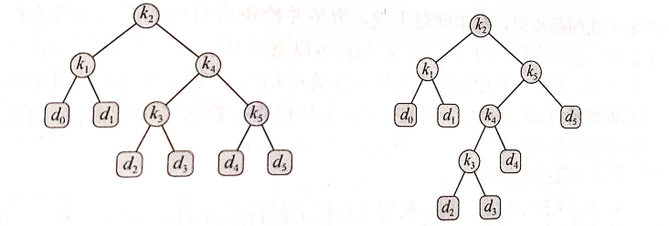
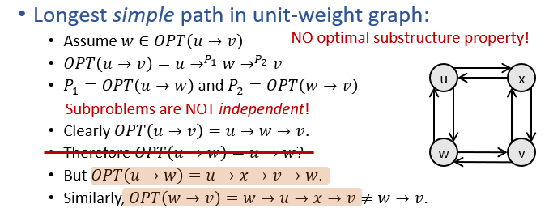

# 动态规划 Dynamic Programming

## 动态规划
+ 考虑一个优化问题
  + 逐步建立最优解
  + 要求问题具备最优子结构性质
    + 最优子结构性质保证了递归解的存在
  + 在递归方法中存在大量重复解决子问题的现象
    + 使用带有备忘机制的递归算法，或
    + 找到**合适顺序**，逐个解决子问题
      + 合适的顺序指，在解决某个子问题时，其所依赖的子问题都已被解决。
+ Floyd-Warshall算法实际上也是**自底而上**的动态规划算法，dist数组即为备忘机制，并且问题的解决顺序为r的增大顺序。

## 构造DP算法
+ 考虑好解的递归结构
  + E.g.:【Rod-Cutting】：(one cut of length i)+(solution for length n-i)
+ 建立备忘机制
+ 由最优子结构性质，得到最优解的结构
  + 实际上就是在解决各个子问题的假设下，怎样从子问题的解得出原问题的最优解
  + 【Rod-Cutting】：取最大的一种情况
+ 使用自底而上（递归）或自上而下（迭代）方法，设计算法计算最优解的值
  + Top2Down or Bottom2Up
+ 得出最优解的详细构造
  + 记录下最优解的各个选择

---
## The Rod-Cutting Problem
+ Assume we are given a rod of length n, We sell length i rod for a price $p_i$, where $i\in\mathbb{N}^+$ and $1\leq i\leq n$
+ 如何切割钢条才能最大化利润？

### 贪心算法
+ 令$r_k$为长度为k的钢条能获得的最大利润
+ 贪心策略为每次选择单位长度利润最高的割法
+ 最优子结构性质显然满足：$r_n = max(p_i+r_{n-i})$
+ 贪心选择性质不能满足，类似于0-1背包问题
  + 考虑n=3, p1=1, p2=7, p3=9作为一个特例

### 递归算法
+ 使用分治思路
```python
CutRodRec(prices, n):
if n==0
    return 0
r = -INF
for i=1 to n
    r = Max(r, prices[i]+CutRodRec(prices, n-i))
return r
```
+ 时间复杂度为$O(2^{n-1})$.(考虑每个单位长度处是否要去切割)  
  

### 动态规划方法
#### 递归版本
+ 引入备忘机制，记住每个已被解决的子问题
```python
CutRodRecMem(prices, n):
for i=0 to n
    r[i] = -INF
return CutRodRecMemAux(prices, r, n)

CutRodRecMemAux(prices, r, n):
if r[n]>0
    return r[0]
if n==0
    q = 0
else
    q = -INF
    for i=1 to n
        q = Max(q, prices[i]+CutRodRecMemAux(prices, r, n-i))
r[n] = q
return q
```
+ 时间复杂度为$O(n^2)$
+ 图形解释
  + 
  + 该图一定是有向无环图
  + 解决该问题的思路类似于DFS

#### 迭代版本
+ **要想转换为迭代版本，我们要找到一种顺序来依次解决各个子问题，使得在解决某个子问题时，它所依赖的其他子问题都已被解决**
+ **按照逆拓扑排序的顺序解决子问题！**
```python
CutRodIter(prices, n):
r[0] = 0
for (i=1 to n)
    q = -INF
        for j=1 to i
            q = Max(1, prices[j]+r[i-j])
        r[i] = qreturn r[n]
```
+ 时间复杂度仍然为$O(n^2)$
+ 然而上述算法仅能得出最大利润，却无法给出切割方案。因此可进一步改进
```python
CutRodIter(prices, n):
r[0] = 0
for i=1 to n
    q = -INF
    for j=1 to i
        if (q<prices[j]+r[i-j])
            q = prices[j]+r[i-j]
            cuts[i] = j
    r[i] = q
return r[n]

PrintOpt(cuts, n):
while n>0
    Print cuts[n]
    n = n-cuts[n]
```

---
## 矩阵乘法
+ INPUT: Matrices $A_1, A_2, ..., A_n$,$A_i$的大小为$p_{i-1}\times p_i$
+ OUTPUT: $A_1A_2...A_n$
+ PROBLEM: 用最小的代价计算乘法结果
+ 按照不同的结合律进行计算的代价是完全不同的

#### 动态规划算法
+ 找到解的递归结构
  + 最后一步可被看作$(A_1A_2...A_k)\cdot(A_{k+1}A_{k+2}...A_n)$
  + 因此中间的任何步骤都可被看作$(A_iA_{i+1}...A_k)\cdot(A_{k+1}A_{k+2}...A_j)$
+ 建立备忘机制
  + 令$m[i, j]$表示计算$A_i...A_j$的最小代价
+ 找到最优解的递归结构
  + $m[i, j] = min_{i\leq k < j}(m[i, k]+m[k+1, j]+p_{i-1}p_kp_j)$
+ 计算最优解的值
  + Top-Down(recursion with memorization), easy.
  + Bottom-Up
    + 在网格中考虑，最终要解决最右上角的问题，而解决每个问题的前提是它左边和下边的子问题已被解决 
    + 可以按照从每个对角线向右走一只走到右边的方法
      
+ 构造最优解
  + 添加数组solution用于记录在计算$A_i...A_j$时我们所选择的k
```python
MatrixChainDP(A1, A2, ..., An):
for i=1 to n
    m[i, j] = 0
for l=2 to n
    for i=1 to n-l+1
        j = i+l-1
        m[i, j] = INF
        for k=i to j-1
            cost = m[i, k]+m[k+1, j] + p[i-1]*p[k]*p[j]
            if cost < m[i, j]
                m[i, j] = cost
                solution[i, j] = k
return <m, solution>

MatrixChainPrintOpt(solution, i, j):
if i==j
    print("Ai")
else
    print("(")
    MatrixChainPrintOpt(solution, i, solution[i, j])
    MatrixChainPrintOpt(solution, solution[i, j], j)
    print(")")
```

## 编辑距离（Edit Distance）
+ Given two strings, how similar are they?
+ Edit Distance of A and B is defined as **# of ops to transform A to B**
  + ops$\in$
    + Insertion: insert a character at a position
    + Deletion: delete a character at a position
    + Subtitution: change a character to another one

#### 动态规划算法
+ 找到解的递归结构
  + 一种可视化编辑操作的方法
    
    
+ 建立备忘机制
  + dist(i, j)表示A[1...i]和B[1...j]之间的edit distance
+ 找到最优解的结构  
  
+ 计算最优解的值
  + Bottom-Up：由于每一个子问题所依赖的子问题为左方\上方\左上方的网格，因此从左到右从上到下遍历网格即可  
    
+ 构造最优解
```python
EditDistDP(A[1...m], B[1...n])
for i=0 to m
    dist[i, 0] = i
for j=0 to n
    dist[0, j] = j
for i=1 to m
    for j=1 to n
        delDist = dist[i-1, j]+1
        insDost = dist[i, j-1]+1
        subDist - dist[i-1, j-1] + Diff(A[i], B[j])
        dist[i, j] = Min(delDist, insDist, subDist)
        solution[i, j] = corresponding operation
return dist
```

## 最大独立集
+ Given an undirected graph G=(V, E), an independent set I is a subset of V, such that no vertices in I are adjacent
+ A maximum independent set (MaxIS) is an independent set of maximum size
+ 由于一般图的最大独立集计算十分困难，因此下面仅考虑以r为根的树的最大独立集

#### 动态规划算法
+ 解的递归结构
  + Given an IS of T, for each child u of r, set $I\cap V(T_u)$ is an IS of $T_u$
+ 设计备忘录
  + let $mis(T_u, 1)$ be the size of MaxIS of $T_u$ s.t. u in the MaxIS
  + let $mis(T_u, 0)$ be the size of MaxIS of $T_u$ s.t. u NOT in the MaxIS
+ 最优解的递归结构
  + $mis(T_u, 1) = 1+\sum_{v\ is\ a\ child\ of\ u}mis(T_v, 0)$
  + $mis(T_u, 0) = \sum_{v\ is\ a\ child\ of\ u}mis(T_v)$
  + $mis(T_u) = max\{mis(T_u, 0), mis(T_u, 1)\}$
+ 计算最优解的值
  + 递归算法
```python
MaxISDP(u):
mis1 = 1
mis0 = 0
for each child v of u
    mis1 = mis1 + MaxISDP(v).mis0
    mis0 = mis0 + MaxISDP(v).mis
mis = Max(mis0, mis1)
return <mis, mis0, mis1>
```
  + 迭代算法
    + 可以使用DFS，然后按照结束时间来设计迭代顺序

## Subset Sum
+ 给定整数序列X[1, 2, ..., n]，能否找到X的子集，使得子集中元素之和为T？

### 动态规划算法
+ 解的递归结构  
  
+ 最优解的递归结构
  
+ 建立备忘机制
  + 建立二维数组ss[1...n, 0...T]
+ 伪代码如下
```python
SubsetSumDP(X, T):
ss[n, 0] = True
for (t=1 to T)
    ss[n, t] = (X[n]==t)? True:False
for (i=n-1 downto 1)
    ss[i, 0] = True
    for (t=1 to X[i]-1)
        ss[i, t] = ss[i+1, t]
    for (t=X[i] to T)
        ss[i, t] = Or(ss[i+1, t], ss[i+1, t-X[i]])
return ss[1, T]
```
+ 时间复杂度为$O(nT)$-----并不一定比$O(2^n)$要好

## 最长公共子序列 LCS
+ 给定序列$X=<x_1, x_2, ...,x_m>$，另一个序列$Z=<z_1, z_2, ..., z_k>$满足下列条件时被称为X的子序列
  + 存在一个严格递增的X的下标序列$<i_1, i_2, ..., i_k>$，且$x_{i_j}=z_j, j=1, 2, ..., k$.

### 动态规划算法
+ 令序列$X$的第$i$前缀为$X_i=<x_1, x_2, ...,x_m>$，其余序列的第$i$前缀同样定义
+ 设计备忘机制
  + 令$c[i, j]$表示$X_{i}, Y_j$的LCS长度
  + $c[i, j]=\left\{
    \begin{aligned}
    &0 &i=0, j=0\\
    &c[i-1, j-1]+1 &i,j>0, x_i=y_j\\
    &\max(c[i, j-1], c[i-1, j]) &i,j>0,x_i\not =y_j
    \end{aligned}
    \right .$
+ 设计存放操作的数组b
  + b的各元素$\in \{"leftup", "up", "left"\}$
+ 计算
```python
LCS-LENGTH(X, Y):
m=X.length
n=Y.length
for i=1 to m
    c[i, 0] = 0
for j=0 to n
    c[0, j] = 0
for i=1 to m
    for j=1 to n
        if X[i]=Y[j]
            c[i, j] = c[i-1, j-1] +1
            b[i, j] = "leftup"
        else if c[i, j-1] >= c[i-1, j]
            c[i, j] = c[i, j-1]
            b[i, j] = "left"
        else
            c[i, j] = c[i-1, j]
            b[i, j] = "up"
return c and b
```
+ 空间复杂度优化
  + 一种思路是去掉表b，并通过判断$c[i-1, j-1],c[i, j-1],c[i-1, j]$的值来重构最优解
  + 另一种思路是，在计算表c时只是用当前行和前一行的数据。但是这样就无法用思路一中的方法重构最优解，因此这种思路下仍然需要保留表b

## 最优二叉搜索树
+ 形式化定义如下
  + 给定一个n个不同关键字的已排序序列$K=<k_1, k_2, .., k_n>$，对每个关键字$k_i$，都有一个概率$p_i$表示该关键字的搜索频率
  + 由于需要搜索的值并不是离散的，因此定义n+1个伪关键字$d_0, d_1, ...,d_n$表示不在$K$中的值。其中$d_0$表示小于$k_1$的值，$d_i$表示介于$k_i$和$k_{i+1}$的值，$d_n$表示大于$k_n$的值。对于每个伪关键字，同样定义对应的搜索频率$q_0, q_1, ...,q_n$.
  + 定义二叉搜索树的结构如下
    + 每个内节点为给定的关键字
    + 每个叶节点为给定的伪关键字
    + 搜索到内节点终止时表示搜索成功，否则搜索到叶节点后表示搜索失败
    + $\sum_{i=1}^np_i+\sum_{i=0}^nq_i=1$
    + 对于给定的关键字和伪关键字，其中两种可能的二叉搜索树如图所示
    
  + 定义在搜索二叉树中进行一次搜索的期望代价为
    + $E=\sum_{i=1}^n(\text{depth}_T(k_i)+1)\cdot p_i+\sum_{i=0}^n(\text{depth}_T(d_i)+1)\cdot q_i=1+\sum_{i=1}^n\text{depth}_T(k_i)\cdot p_i+\sum_{i=0}^n\text{depth}_T(d_i)\cdot q_i$
  + 最优二叉搜索树即为搜索代价期望最小的二叉搜索树
### 动态规划算法
+ 解的递归结构
  + 为关键字$<k_i, ...,k_j>$建立二叉搜索树时，从所有的关键字中选择一个关键字$k_t$，然后将$k_t$作为根节点，$<k_i, ...,k_{t-1}>$和$<k_{t+1}, ...,t_j>$递归构造最优二叉搜索树
+ 建立备忘
  + 使用$e[i, j]$代表包含关键字$<k_i, k_{i+1}, ...,k_j>$和相应伪关键字的二叉搜索树的期望代价
  + 使用$w[i, j]$存储以下关键字/伪关键字的搜索代价之和$\sum_{l=i}^j p_l+\sum_{l=i-1}^jq_l$
+ 最优解的递归结构
  + $e[i, j]=\left\{
    \begin{aligned}
    &q_{i-1}&j=i-1\\
    &min_{i\leq r\leq j}\{e[i, r-1]+e[r+1, j]+w[i, j]\}&i\leq j
    \end{aligned}
    \right .$
+ 计算最优解（注意同时我们也使用了$w$来避免对$w[i, j]$的重复计算）
  + 同时使用数组root重构最优解
```python
OPTIMAL-BST(p, q, n):
let e[1...n+1, 0...n], w[1...n+1, 0...n], and root[1..n, 1...n] be new tables
for i=1 to n+1
    e[i, i-1] = q[i-1]
    w[i, i-1] = q[i-1]
for l=1 to n
    for j=1 to n-l+1
        j=i+l-1
        e[i, j] = INF
        w[i, j] = w[i, j-1] + p[j] + q[j]
        for r=i to j
            t = e[i, r-1]+e[r+1, j]+w[i, j]
            if t<e[i, j]
                e[i, j] = t
                root[i, j] = r
return e and root
```
---
## DP中的空间优化
+ 在建立备忘机制后，表格中每个方格所依赖的子项往往只有相邻位置的方格。因此在填表时可以对空间开销进行优化。
```python
EditDistDP(A[1...m], B[1...n]):
for j=0 to n
    distLast[j] = j         # distLast[j] = dist[i-1, j]
for i=1 to m
    disCur[0] = i           # distCur[j] = dist[i, j]
    for (j=1 to n)
        delDist = distLast[j]+1
        insDist = distCur[j-1]+1
        subDist = distLast[j-1]+Diff(A[i], B[j])
        distCur[j] = Min(delDist, insDist, subDist)
    distLast = distCur
return distCur[n]
```
### Edit Distance
+ 在备忘表中，每个格子只依赖左边、上边、左上三个方格，因此算完整个表所需空间可以被优化
+ distLast表示上面一行，distCur表示该行
```python
EditDistDP(A[1…m],B[1…n]):
for (j=0 to n)
    distLast[j] = j
for (i=1 to m)          # distLast[j] = dist[i-1,j]
    distCur[0] = i        # distCur[j] = dist[i,j]
    for (j=1 to n)
        delDist = distLast[j] + 1
        insDist = distCur[j-1] + 1
        subDist = distLast[j-1] + Diff(A[i],B[j])
        distCur[j] = Min(delDist,insDist,subDist)
    distLast = distCur
return distCur[n]
```

### Floyd Warshell
+ 将原备忘录看成是由u, v, r构成的三维矩阵，事实上更新时只用到了r那个维度上相邻的两层二维表。
```python
FloydWarshallAPSP(G):
for (every pair (u,v) in V*V)
    if ((u,v) in E) then dist[u,v]=w(u,v)
    else dist[u,v]=INF
for (r=1 to n)
    for (each node u)
        for (each node v)
            if (dist[u,v] > dist[u,xr] + dist[xr,v])
                dist[u,v] = dist[u,xr] + dist[xr,v]
```
---
## DP算法的正确性分析
+ 实际上只需要证明问题具有最优子结构性质即可
+ 特殊地，如果使用迭代解决动态规划问题，需要证明当前问题以来的子问题已被解决

## DP算法的复杂度分析
+ 时间复杂度
  + 迭代版本：易证
  + 递归版本：需要考虑子问题图的大小。如果在子问题图的每个边上花费常数时间，那么时间复杂度为子问题图的大小
---
## 对动态规划的几点讨论
+ 设计动态规划的解结构和迭代算法时，可考虑结合图和网格等进行考虑
+ 动态规划要求问题一定要**满足最优子结构性质**。
  + 尽管大多数问题都满足最优子结构性质，但仍有部分问题不满足，例如  
    
  + 在上面的问题中，**子问题的最优解不是原问题的可行解**。