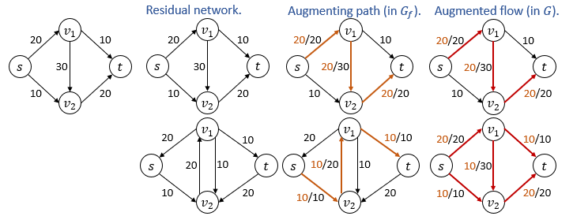
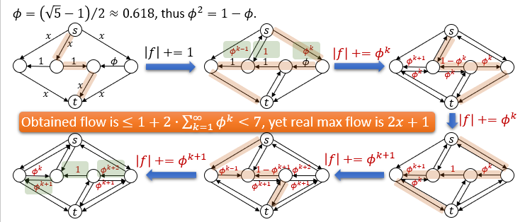
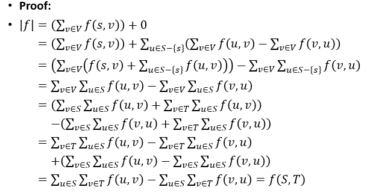
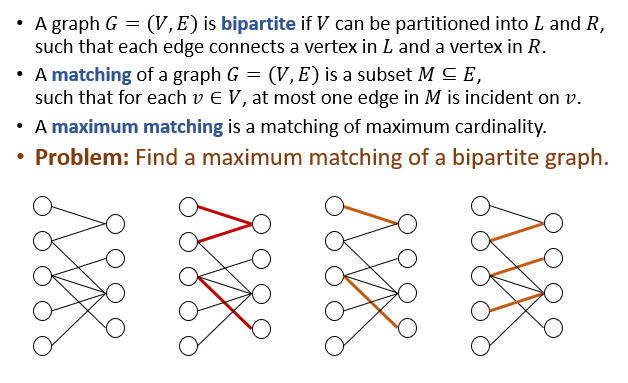
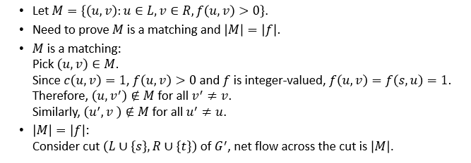

# Network Flow 网络流问题
+ Consider a network with capacity constraints on edges, given a source and a sink(target) t, what is the maximum flow from s to t?
+ A **flow network** is a directed graph $G=(V, E)$ where each edge has a *capacity* $c(u, v)\geq 0$
+ A **flow** in G is a function $f:V\times V\rightarrow R$ satisfying
  + **【Capacity constraint】：For every $(u, v)\in E$, $0\leq f(u, v)\leq c(u, v)$**
  + **【Flow conservation】：For every $u\in V-\{s, t\}$:$\sum_{v\in V}f(v, u)=\sum_{v\in V}f(u, v)$**
+ The **value** of flow 𝑓 is $|f|=\sum_{v\in V}f(s, v)=\sum_{v\in V}f(v, t)$
+ 最大流问题的目标即为寻找最大的网络流 $f$.

## 算法思想
+ 从一个可行解开始，逐步增强到最优解
### Simple Algorithm
+ 从s开始，找到一条到 t 的路径，找到这条路径上的流量限制，生成一个s到t的流f
+ 在原图上减去f（路径各边减去使用的流量）
+ 再找到一条s到t的路径，重复上述步骤直到找不到这样的路径  
  
+ 然而Simple Algorithm只能得到可行解，而无法得到最优解

### Residual Network
+ 给定一个flow network $G=(V, E)$ 和流 $f$, 残余网络被定义为$G_f = (V, E_f)$，其中$E_f = V\times V$，并且边的constraint满足:  
  
+ 直观上，每条残留网络中的边表示
  + 这条边还能承载的流的大小，或
  + 已推送的流中，在这条边上能被取消的流的大小。
+ 在残留网络$G_f$找到从$s$到$t$的一条**简单路径**，设在这条简单路径上能通过的流为$f'$，流$f'$可用于增强原网络中的流$f$  
  
### “增强”证明
+ 令$G$为流网络，$G_f$为残留网络，$f'$为$G_f$中的流
+ 定义$f$通过$f'$的增强为  
  
+ **【Lemma】：$(f\uparrow f')$ is a flow in G, and $|f\uparrow f'|=|f|+|f'|$**  
  
+ **【Lemma】：if 𝑓 is a flow in 𝐺, 𝑓_𝑝 is a flow in 𝐺_𝑓, then (𝑓↑𝑓_𝑝 ) is a flow in 𝐺.Moreover, |𝑓↑𝑓_𝑝 |=|𝑓|+|𝑓_𝑝 |.**
+ 因此，原网络中的流可被残留网络中的流增强

### Ford-Fulkerson Algorithm
+ 不断计算当前流的残留网络增强现有流，直到残留网络中不再存在增强流
```python
FordFulkersonMaxFlow(G, s, t):
Initialize flow f to value 0
while there is an augmenting path p in Gf
    Augment flow f along path p
    Update Gf
return f
```


### Ford-Fulkerson算法复杂度分析
+ 令$G$为连通图，因此$|E|=m>n=|V|$
+ 初始化步骤（寻找一条通路）需要$O(m)$时间
+ 每一轮只需要遍历一次图即可维护残留网络，因此每次迭代的代价为$O(m)$
+ 下面讨论迭代次数
  + 若capacity均为**正整数**
    + 由于每次迭代最大流$f$均至少增加1，因此至多有$O(f_{OPT})$次迭代
    + 故时间复杂度为$O(m\cdot f_{OPT})$
    + 极端情况下（每次增加一）的一个例子如图
    + 
  + 若capacity为**有理数**
    + 类似前一种情况，可以将有理数整数化
    + 运行时间仍为$O(m\cdot f_{OPT})$
  + 若capacity为**正实数**
    + Ford-Fulkerson算法可能无法终止（不断找到增强流），甚至无法收敛到最大流
    + 例如下图
      


---
## 最大流最小割定理
+ 定义 **Cut**: A cut of flow network G=(V, E) is a bipartition (S, T) of V such that $s\in S$ and $t\in T$, $S\cup T=V$ and $ST=\emptyset$
+ 定义 **Capacity** of cut $(S, T)$：$c(S, T)=\sum_{u\in S}\sum_{v\in T}c(u, v)$
+ 定义 Given flow $f$, **net flow** across the cut $(S, T)$：$f(S, T)=\sum_{u\in S}\sum_{v\in T}f(u, v)-\sum_{u\in S}\sum_{v\in T}f(v, u)$
+ 定义 **Min-Cut**：a cut of minimum capacity among all cuts  
  
+ **【Lemma】：Given a flow f in a flow network G, let $(S, T)$ be any cut of G, then $|f|=f(S, T)$**  
  
+ **【Corollary】:For any flow $f$ and any cut $(S, T)$, value of flow is *at most* the capacity of the cut. That is $|f|\leq c(S, T)$.** (任意流小于等于任意割)
+ 事实上，上述定理可以被增强到（**最大流等于最小割**）
+ **【Theorem 最大流最小割定理】：Actually, The following three conditions are equivalent:**  
  **(a) Flow f is a max-flow G**  
  **(b) Residual graph $G_f$ has no augmenting path**  
  **(c) $|f|=c(S, T)$ for some $cut(S, T)$ of $G$**
+ 定理证明分为三部分
  + 
  + 
  + 

## Max-Flow Min-cut and LP Duality
+ 最大流问题可被建模为线性规划问题P
+ 因此P一定有一个对偶问题D
+ 根据强对偶性：$OPT(P)=OPT(D)$
+ 然而最小割并不正好是P的对偶问题。最小割问题可以被建模为整数规划问题(ILP) D‘，而最大流的对偶问题D是D’的放松。
+ 因此，$OPT(D')\geq OPT(D)$
+ 幸运的是，$OPT(D')=OPT(D)$
+ 因此$OPT(P)=OPT(D')$

## 最大流最小割定理应用
+ 将最大流算法的应用到分割相关的物体上，比如求解连通图的最小连通度等


---
## 改进Ford-Fulkerson算法
### 方法一
+ 在选择增强流时，每次都选择瓶颈值最大的增强流
  + 选择方法可使用类似Dijkstra算法中的松弛思想，不过是向“更大的瓶颈值”方向松弛
  + 选择可在$O(m\log n)$时间内完成
+ 下面评估算法性能
  + **【Flow Decomposition】：Given $G$ and a flow $f$, there is a collection of flows $f_1, f_2, ...,f_k$, and a collection of $s\rightarrow t$ paths $p_1, p_2, ...,p_k$, such that:(a) $k\leq |E|$, (b) $|f|=|f_1|+...+|f_k|$ and (c) $f_i$ only sends flow over $p_i$**
    
  + 令$f$为任何流，令$f'$为$G_f$中的最大流
  + 由路径分解定理，在$G_f$中存在一条flow $\geq|f'|/(2m)$的路径
  + 因此在每一次迭代之后，$|f'|\leq |f'|(1-1/(2m))$（这里为2m的原因是原图中有m条边，残差网络中最多可能有2m条边）
  + 经过$2m\ln(f_{OPT})$次迭代，$|f'|\leq f_{OPT}(1-1/(2m))^{2m\ln (f_{OPT})}<1$
    + 如果capacity均为整数，则算法终止
    + 如果capacity为实数，则算法将逐渐收敛（也有可能无法收敛到最优值）
  + 总而言之，该方法在实数capacity情况下运行时间为$O(m^2(\log n)(\log f_{OPT}))$

### 方法二：Edmonds-Karp
+ 在选择增强流时，选择最短的增强流
  + 直接使用BFS即可
+ 下面评估算法性能
  + 令$d_f(u, v)$表示在图$G_f$中节点$u$和$v$之间的距离
  + **【Lemma1】：Let 𝑠 be the source node, then for each node 𝑣∈𝑉−{𝑠,𝑡}, during execution, $d_f(s, v)$ will not decrease with each flow augmentation.**  
    
  + 从上述过程可发现在增强的过程中，某些边$(u, v)$可能会在当前流中“消失”。
  + **【Lemma2】：each edge (u, v) can disappear for at most $\frac{|V|}2$ times during execution**  
    
  + 因此，算法将在$O(|V|\cdot |E|^2)$时间后终止
  + 由该算法的运行过程也可以发现，该算法永远终止于最优解，除非不能终止。

---
## 网络流应用：最大二分匹配
+ 问题描述  
  

+ 构建网络$G'=(V', E')$
  + $V'=V\cup \{s, t\}$
  + $E'=\{(s, u):u\in L\}\cup \{(v, t):v\in R\}\cup \{(u, v):(u, v)\in E\}$
  + 为每条$E'$中的边分类大小为1的capacity
+ 易见，在$G'$中存在流$f$等价于在二分图$G$中存在匹配$M$，且$|M|=|f|$  
  
+ 因此使用最大流算法即可得到正确结果