# 数据库设计
+ 分析需求实体
+ 列出所有数据库中需要存储的数据项
+ 设计如何存储这些数据。

## 一般朴素设计可能导致的问题
一般朴素设计就是指把所有的属性放在一张表中。问题在于如果属性的值之间的映射并不是一一映射的，那么表内就会有大量的冗余信息  

+ Problems
  + redundency数据冗余
  + abnormality of update修改异常
  + abnormality of delete删除异常
  + abnormality of insert插入异常  
  

## 两条建模思路
1. 数据项 -> E-R model（概念数据模型） -> 数据表 -> logical design of a RDB
2. 数据项 -> 经过正则化，得到logical design of a relational database
---
## Intro to E-R Concept
### Entity（实体）
+ （Entity）实体指的是一系列相互可以区分、拥有相同属性的真实世界的物体集合
+ （Entity Instance）指的是实体的一个实例
### Attribute（属性）
+ 属性用于描述实体的某一个方面
+ 分类
  + 第一种分类方法：根据属性性质
    + identifier：可以用于区分不同实体的属性
    + descriptor：其余的属性。用于描述
  + 第二种分类方法：根据属性取值
    + single-valued attribute：单值属性
    + composite attribute：取值是一个元组
    + multi-valued attribute：取值可以是一个集合

### Relationship（联系）
+ 联系指明了一组实体之间的特定的相互关系，实际上是一组实体的笛卡尔乘积(E1,E2,E3,...,Em)。
+ **联系本质上也是一个表头，联系也有属性**
+ 联系的度：Relation所相关联的实体数量
  + binary relationship：二元联系
  + ring/recursive relationship：将一个实体与该实体自己联系起来的联系
  + N-ary relationship：联系多于两个实体的联系
+ 联系通常在图中使用菱形进行标注。同时为了提高可读性，尽量在链接实体的线段上加上文字进行解释说明。  
  
+ 联系属性的增加  
  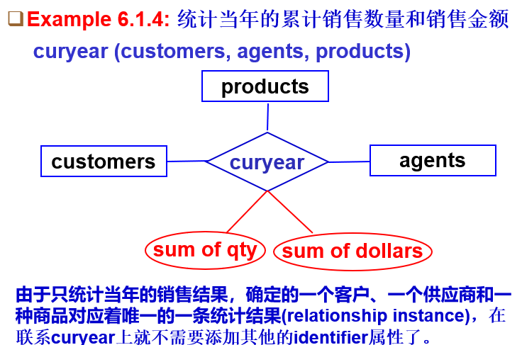

### 联系与实体参与度度量
#### card
+ max-card(E, R)：在联系R下E的像的最大个数
  + max-card(E, R)=1：E最多只有一个像
  + max-card(E, R)=N：E最多可以有多个像
+ min-card(E, R)：在联系R下E的像的最小个数
  + min-card(E, R)=1：E至少有一个向
  + min-card(E, R)=0：E可能没有像
+ Card(E, R)：Card(E, R)=(min-card(E, R), max-card(E, R))  
  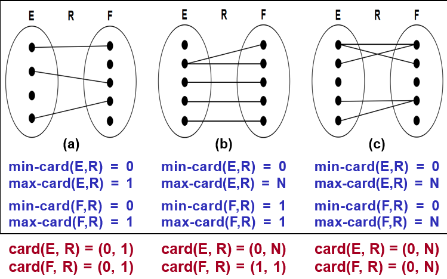
+ 若max-card(E, R) = 1，则E在R上为单值(single-valued)参与；若max-card(E, R) = N，则E在R上为多值(multi-valued)参与
+ 若min-card(E, R) = 1，则E在R上为强制(mandatory)参与；若min-card(E, R) = 0，则E在R上为可选(optional)参与

#### relation分类
+ 设联系R沟通实体E和R
+ One-to-One:max-card(E, R)=max-card(F, R)=1
+ Many-to-One:max-card(E, R)=1, max-card(F, R)=N
+ Many-to-Many:max-card(E, R)=max-card(F, R)=N

### E-R方法构建数据表时的映射规则
+ 规则一：实体被映射到一张表  
  
+ 规则二：每一个多值属性都要被映射到一个新表  
  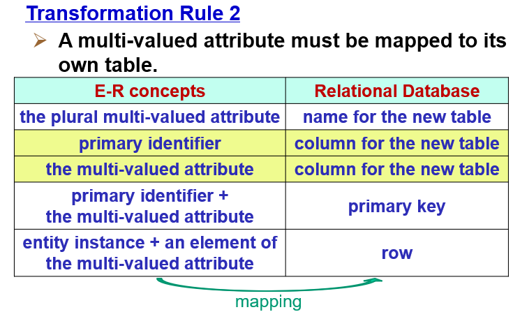
+ 规则三：若关系为Many-to-Many  
  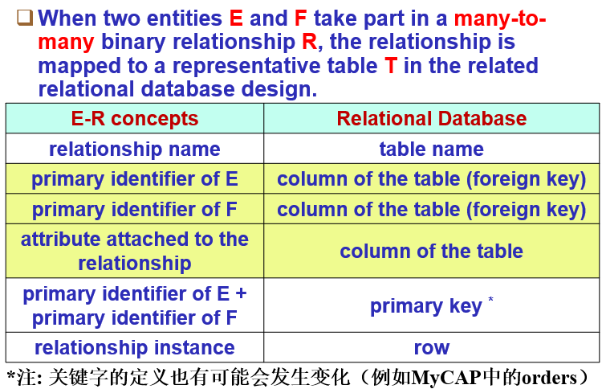
+ 规则四：若关系为Many-to-One  
  
+ 规则五：若关系为One-to-One  
  
+ **对于规则三四五，通常情况下生成的新表的关键字都需要重新考虑。这一部分将在后续的规范化设计部分中设计，在此不作讨论。**

---
## Normalization(规范化理论)
+ 更多的时候我们对数据的建模采取以下策略
  + 获取数据
  + 初步进行E-R建模，得到关系表
  + 结果规范化，最终得到logical design of RDB
+ 规范化设计的目标
  + 在一个关系中，属性和属性之间需要满足一定约束。这样的约束条件被称作Normal Form
  + 通常由四个级别的NF：1NF, 2NF, 3NF, BCNF
  + 通常我们需要满足3NF的要求
+ 后文中的符号约定
  + 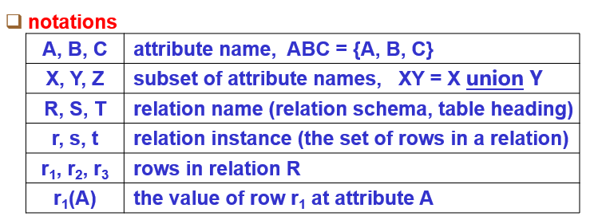

### 函数依赖
#### 定义
+ A$\rightarrow$B $\Leftrightarrow$ For any rows r1 and r2 in any instance of relation T, if r1(A) = r2(A) then r1(B) = r2(B)
+ 表示B函数依赖于A或A函数决定B
+ A和B是两个属性集合且来自于同一个关系
+ 函数依赖实际上来自于对现实世界中数据约束的抽象,因此函数依赖关系属于语义范畴，需要在建立数据表之间就对函数依赖加以考虑
+ 一组图示，从函数对应的观点理解AB的依赖关系
  + 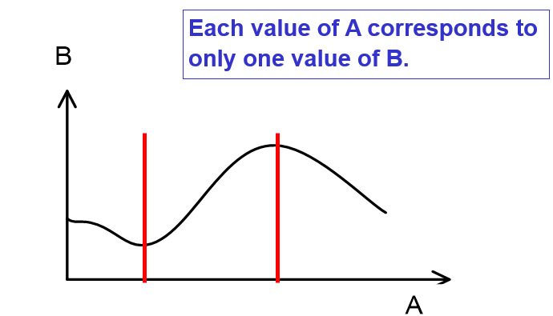
  + 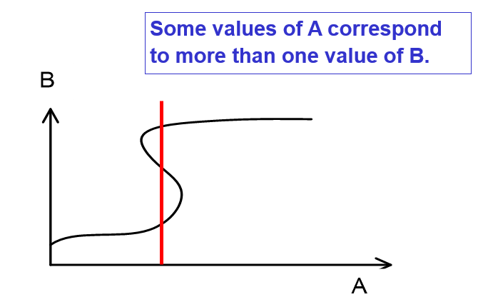  
    **注：在这种情况下B可能函数决定A！**
+ 从E-R模型中的对应性理解函数依赖
  

    
### Armstrong's Axioms(Armstrong公理)
+ 由已知的一些函数依赖，可以推导出另外一些函数依赖。这就需要定义一些推导规则。
+ **【Rule1 自反规则】：If Y$\subset$X，then  X$\rightarrow$Y**
+ **【Rule2 传递规则】：If X$\rightarrow$Y and Y$\rightarrow$Z, then X$\rightarrow$Z**
+ **【Rule3 增广规则】：If X$\rightarrow$Y, then XZ$\rightarrow$YZ**
+ **【Rule4 合并规则】：If X$\rightarrow$Y and X$\rightarrow$Z, then X$\rightarrow$YZ**
+ **【Rule5 分解规则】：If X$\rightarrow$YZ,then X$\rightarrow$Y and X$\rightarrow$Z**
+ **【Rule6 伪传递规则】：If X$\rightarrow$Y, and WY$\rightarrow$Z, then XW$\rightarrow$Z**
+ **【Rule7 聚积规则】：If X$\rightarrow$YZ and Z$\rightarrow$W, then X$\rightarrow$TZW**
+ **note:XY表示属性X和属性Y的union**

### 平凡函数依赖，完全函数依赖和部分函数依赖
+ 平凡函数依赖：如果Y$\subset$X，那么依赖X$\rightarrow$Y为平凡函数依赖
+ 部分函数依赖：函数依赖FD:X$\rightarrow$Y是部分函数依赖，如果存在另一个W，使得W$\subset$X ans W$\rightarrow$Y（可理解为去除X中的水分）
+ 非部分函数依赖即为完全函数依赖。

### 函数依赖集F的闭包
+ $F^+=${根据F中已有的函数依赖，利用Armstrong公理系统能够推到得到的所有函数依赖}
+ 具体计算过程如下
  + F中的每一个函数依赖都是其闭包F+的成员
  + 利用自反规则推导得到的所有平凡函数依赖，也都是闭包F+的成员
  + 如果函数依赖f1,f2,...,fk(k≥1)是闭包F+的成员，且利用Armstrong公理系统能够从f1,f2,...,fk推导得到函数依赖f，则函数依赖f也是闭包F+的成员
  + 重复步骤上述步骤，直至F+中不再有新的函数依赖加入
+ 例子：  
  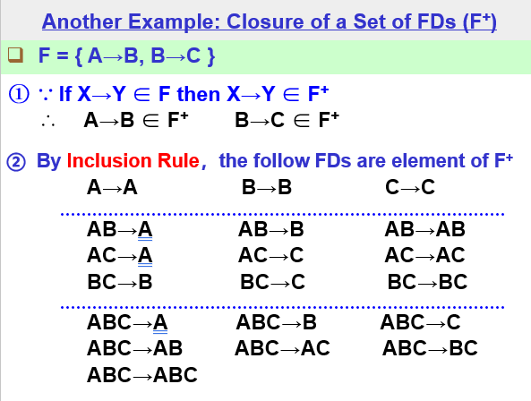
  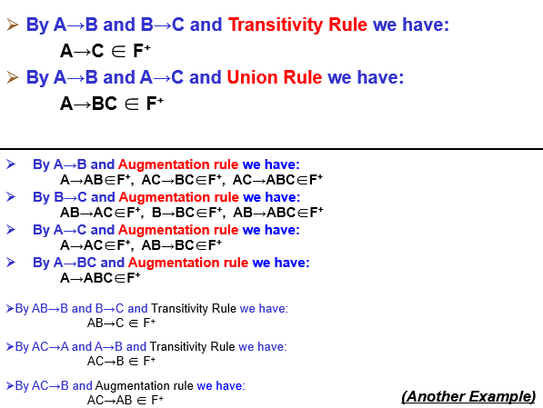
  
  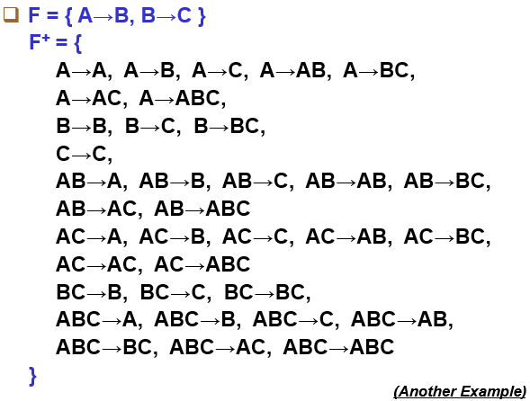

### 函数依赖集F的覆盖
+ 如果函数依赖集F**覆盖**函数依赖集G，意味着G$\subseteq$F$^+$，也就是G中的函数依赖可被F中的函数依赖推导出来

### 最小覆盖
+ 如果M是给定的函数依赖集F的最小覆盖，则
  + M没有冗余的函数依赖：我们无法找到M的真子集H使得H也覆盖F
  + M中的每一个函数依赖关系都是完全函数依赖
+ 计算方法  
  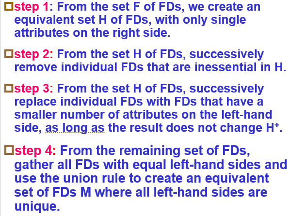

### 正则化方法
+ 将一个表分解成两个或更多表的过程即为正则化  
  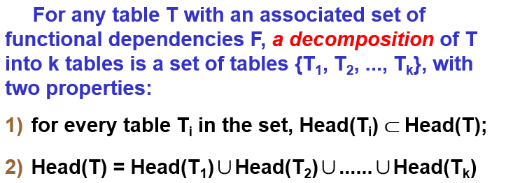
#### 无损分解
+ 设表$T$分解得到的表为$\{T_1, T_2, ..., T_k\}$
+ 若$T\equiv T_1$ join $T_2$ join ...$T_k$，则该分解为**无损分解**
+ 若$T\subset T_1$ join $T_2$ join ...$T_k$，则该分解为**有损分解**
+ join：关系代数中的表连接运算
+ 有损分解的含义即为：在分解过程中丢失了一部分语义（表头之间的函数依赖）
#### 数据库模式
+ 数据库模式是指在分解过程中我们希望保持的表头的集合和函数依赖关系的集合。  
  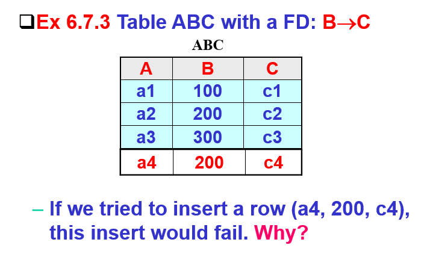
  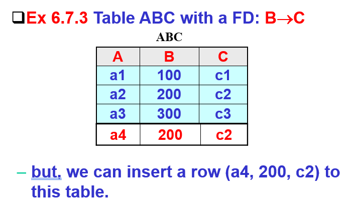
+ 【Theorem】：给定一个满足函数依赖集合F的表T，那么关于T的分解{$T_1$,$T_2$}是无损分解，如果下面的两种函数依赖关系之一能由F推断得到
  + $Head(T_1)\cap Head(T_w)\rightarrow Head(T_1)$
  + $Head(T_1)\cap Head(T_2)\rightarrow Head(T_2)$

#### 依赖保持性
+ 对于一个给定的表T和它的数据库模式，令$\{T_1, T_2, ..., T_k\}$为T的一种无损分解
+ 则FD：$X\rightarrow Y$在T的分解中被保持，如果存在某个$T_i$使得$X\cup Y\subset Head(T_i)$.

### 关键字与主属性
#### superkey
+ 【Theorem】：X为superkey等价于X能够函数决定T中的其他所有属性
+ 即$X\rightarrow Head(T)$ or $X^+_F=Head(T)$
+ 如果X进一步是完全函数决定，则X是一个关键字
+ 关键字的计算也有优化方法  
  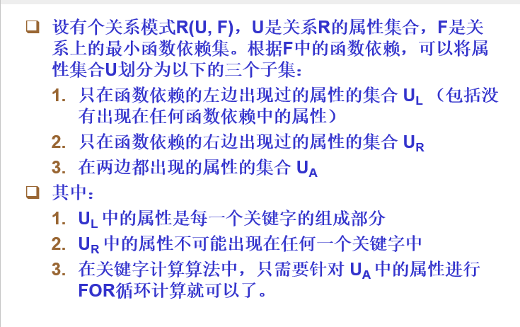

#### 寻找候选关键字
```python
set K = Head(T)
for each attribute A in K:
  compute (K - A) 的闭包
  if 该闭包包含T中的所有属性
  then set K = K-{A}
```
+ for循环的遍历顺序可能会影响得到的候选关键字的结果
+ 因此如果需要找到所有的候选关键字，可以遍历for循环的每种可能

+ 优化算法
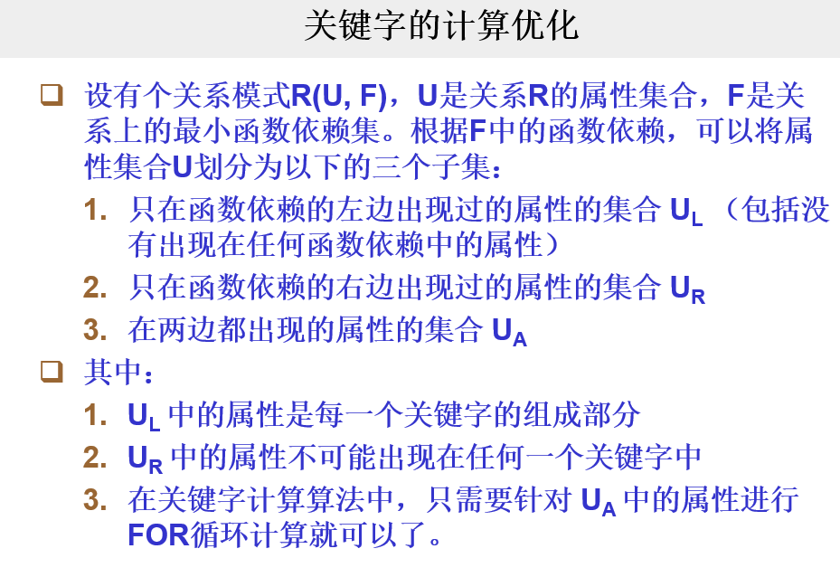

#### 主属性与非主属性
+ 主属性指任何可能出现在T的某一个关键字中的属性
  + 主属性的定义十分宽泛，只要求该属性能够出现在某一个关键字中即可
+ 非主属性为不为主属性的属性

### Normal Forms 范式
#### BCNF
+ 关系模式T的函数依赖集合F满足BCNF**当且仅当对于任何F的闭包中的函数依赖FD：$X\rightarrow A$，若A是不在X中的单个属性，则X一定是T的一个superkey**
+ 判别算法  
  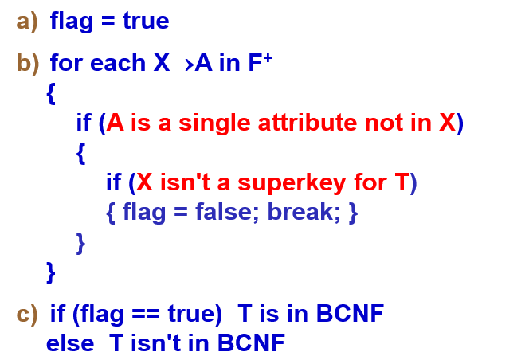
+ 这也表明了一种可行的模式分解方法：如果找到了一个不满足BCNF的函数依赖，那么就可以将属性A分解出去，直到每一个子模式都满足BCNF

#### 3NF
+ 关系模式T的函数依赖集合F满足3NF**当且仅当对于任何F的闭包中的函数依赖FD：$X\rightarrow A$，若A是不在X中的单个非主属性，则X一定是T的一个superkey**
+ 首先考虑关系模式的非主属性，往往能使问题得到简化

#### 2NF
+ 关系模式T的函数依赖集合F满足2NF**当且仅当对于任何F的闭包中的函数依赖FD：$X\rightarrow A$，若A是不在X中的单个非主属性，则X一定不被任何T的关键字包含**

#### 满足3NF的关系分解算法


#### 模式分解的一般算法
+ 首先计算F的最小覆盖，从中寻找不满足范式M要求的函数依赖
+ 选择一个不符合要求的函数依赖并作如下分解
  + $R_1(X\cup Y, {X\rightarrow Y})$
  + $R_2(Heading(R)-Y, F_2)$
  + $F_2={A\rightarrow B|A\rightarrow B\in F^+}$
+ $R_2$仍有可能不满足范式M的要求，重复上述步骤即可。
+ 合并具有相同关键字的子关系模式

#### 一个例子
+ 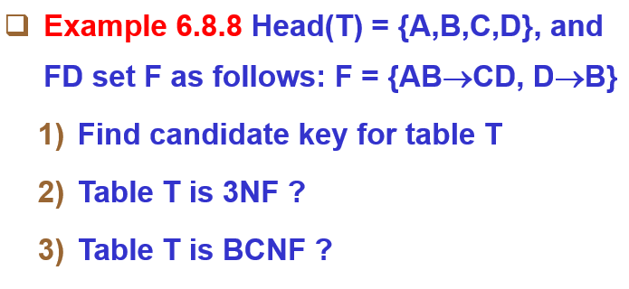
+ 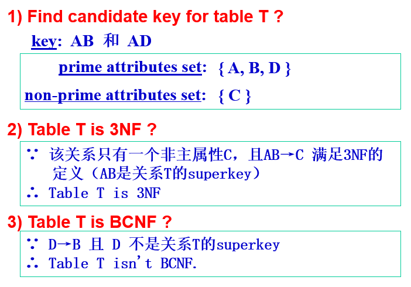


---
## 数据库设计样例
+ 题目：  
  